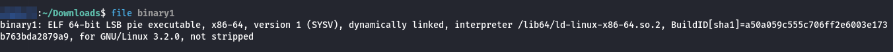
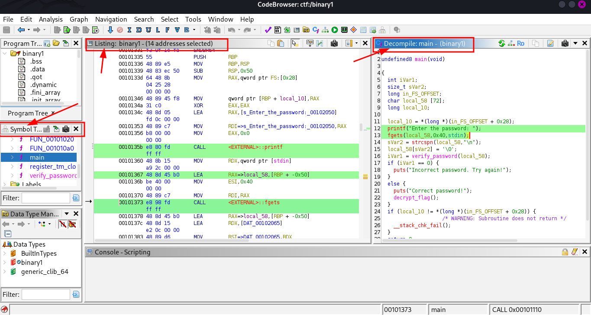
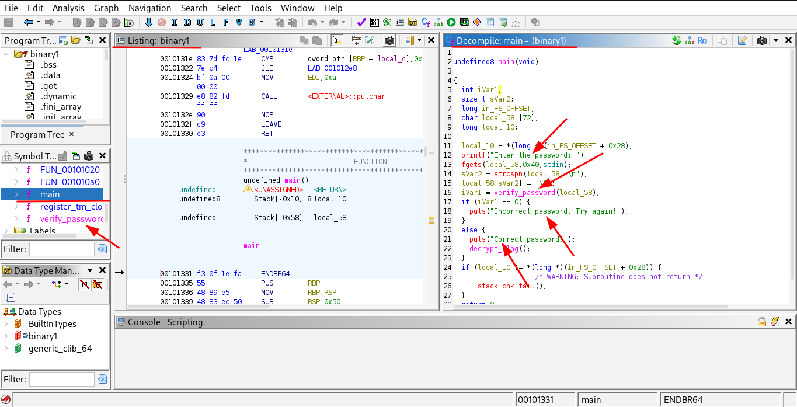
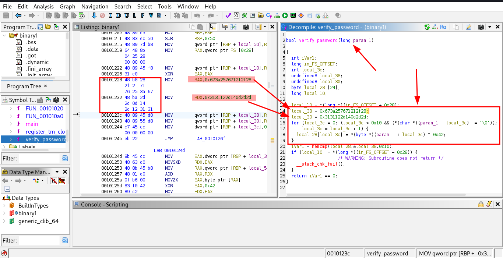

### Introduction
This was a warm up CTF challenge by HACKVERSE hosted by EC-Council, this was new to me but with the help of chatgpt i got to know some this new. In hear i will explain what was the challenge and how i achieved it.

The challenge is below.

```
Binary Reverse Engineering is the art of taking apart compiled programs to understand how they work, uncovering their secrets without access to source code. In this challenge, you're given mysterious binary files that seem to be checking for a specific input. Your task is to:

1. Analyze the binaries to understand their validation logic
2. Figure out what input will make the programs reveal their flag

**Question 2**

What is the correct password for binary1? (The answer is case-sensitive)

**Important Security Notice**

This challenge may include components that may be flagged by antivirus software due to their legitimate but potentially dual-use nature. While our code contains no malicious elements, we recommend the following security precautions:

- Run this challenge in an isolated virtual machine
- Disconnect the virtual machine from network access
- Use a dedicated testing environment if possible

These measures will ensure optimal security while completing the challenge.

_Solving this challenge will unlock Question 3_
```

After reading this i was "Reverse Engineering", then thought to quit but i was like it will be good learning experience like a kick start for Reverse Engineering so i downloaded the binary file and started.

Hear i was new and i did't knew what to do so i firstly check what file type it was :-



```
~/Downloads$ file binary1
binary1: ELF 64-bit LSB pie executable, x86-64, version 1 (SYSV), dynamically linked, interpreter /lib64/ld-linux-x86-64.so.2, BuildID[sha1]=a50a059c555c706ff2e6003e173b763bda2879a9, for GNU/Linux 3.2.0, not stripped
```

The output is a ELF binary file which is executable, now hear is a advice pls run these or any binaries for the reverse engineering task on a virtual environment, this one is not harmful but is advised but pro's

After doing *chmod +x binary1* i ran the ELF file and it asks for password which is what the task says "we need to find the password and the flag"

Now for ur information when a developer write's a binary or a exe application it is protected or we can say is encrypted we need to identify that first and then we will go with the main part.

We will check this by using the *checksec command* :-

```
~/Downloads$ checksec --file=./binary1
RELRO           STACK CANARY      NX            PIE             RPATH      RUNPATH	Symbols		FORTIFY	Fortified	Fortifiable	FILE
Full RELRO      Canary found      NX enabled    PIE enabled     No RPATH   No RUNPATH   47 Symbols	  No	0		2		./binary1

```

Now at this point i did what i can from my brain then i used chatgpt to grasp more about the output and hear is a summarized version. For now just keep in mind later search in google for more.

| Protection | Status          | Explanation                                                                                   |
| :--------- | :-------------- | :-------------------------------------------------------------------------------------------- |
| RELRO      | ✅ Full RELRO    | Critical sections like the GOT are read-only after loading, mitigating GOT overwrite attacks. |
| Canary     | ✅ Canary found  | Protects against stack buffer overflows using a guard value before return addresses.          |
| NX (DEP)   | ✅ NX enabled    | Non-Executable stack – makes code execution on the stack impossible (thwarts shellcode).      |
| PIE        | ✅ None          | No risky runtime library search paths. Good.                                                  |
| Symbols    | ⚠️ Present (47) | The binary is **not stripped**, making reverse engineering easier.                            |
| FORTIFY    | ❌ Not used      | Fortify Source (safe libc functions like `strcpy` → `__strcpy_chk`) **not used**.             |

Now that we did some manual work we will be using a famous tool "GHIDRA" by the famous intelligence agency "NSA".

Installation 

```
sudo apt install ghidra
```

Then launch it, After launching follow these steps.

### **Create a New Project**

- When Ghidra starts, choose:

	- **Project Type**: _Non-Shared Project_

    - **Project Name**: e.g., `binary1_analysis`

    - Choose a location to store it (any folder you want)

### **Import the Binary**

- In the **Project Window**:
    
    - Go to **File → Import File**

    - Select your `binary1` file

    - Ghidra will auto-detect it as an ELF 64-bit binary. Click **OK** through the prompts.


### **Open in CodeBrowser**

- Double-click `binary1` in the project tree
    
- It will ask:
    - **“Do you want to analyze it?”** → ✔️ Yes

    - Leave most analysis options enabled (default is fine)

    - Click **Analyze**

### **Explore the Program**

- Ghidra’s UI has multiple windows:
    
    - **Listing** (disassembly + decompiled code)
        
    - **Decompiler** (top-right) — very readable C-like code
        
    - **Symbol Tree** (left sidebar) — navigate functions, labels, etc.

Now that we have imported the binary file and analysed it, now in the ghidra gui we will be focusing on 3 thing hear the "Symbol Tree" the "Listing Window"  and the "Decompile Window". [Hear](https://www.youtube.com/watch?v=fTGTnrgjuGA) is a good youtube video explaning it more neet.

The listing window shows the assembly code.
The decompile windows shows the C code.
The symbol tree shows us the functions.



Hear is won't be going deep, in the symbol tree window we can see the functions and the main function specificily double click on main and code for that function will appear in the listing and the decompile window.

Now hear as is said i wont be explaining everything, hear we will look for the strings which we were asked for when we ran the binary that is the "enter pass" "incorrect pass" and we will analyse the main function's code.

As in below image we can see the callings and the printf statements with the user prompt, upon closer inspection i see that one more function is also called named "verify_password" and as the name is indicating it will verify the password.



Now to navigate to the verify_password function double click on the verify pass function and it will be updates automatically or click on verify pass from symbol tree.

Now when we take a look at the code of the verify_password function we see 3 things "llocal_38 = 0x673a257671212f28" "local_30 = 0x3131122d140d2d2d;" and the for loop below it.



Now the variable we can say for now "local_30 and local_38" are constants with a value of 8 bytes each which is 8 + 8 =16 Bytes and its ins hexadecimal.

Now if ur are smart enough (meaning if u know how to read a c code) u would have guessed it that what this function does :-

What this means :

1. **Two 8‑byte constants** (`local_38` and `local_30`) hold **16 “secret” bytes**.
    
2. Your **input** is XORed with `0x42`.
    
3. The result is **compared** to those 16 secret bytes.
    
4. If they match → **correct password**.

Now that we know what this function does time to decrypt the password, in the above image i have highlighted some lines in hex code, 

To the left side of hex code is our password in bytes which we need to retrive how lets do it . Now in assembly hear specificially the first 2 bytes are the instructions give to the memory bu the program called "opcode".

```
so the byted for local_38 =  28 2f 21 71 76 25 3a 67 and for local_30 =  2d 2d 0d 14 2d 12 31 31
```

Now that we have these bytes we need to XOR it with 0x42 which is 66 is decimal, we will use python hear to do that.

Since we need to do a XOR first we will take a list of all out bytes which is 0x28 ..... naming the list as data.

Then we will XOR each byte with 0x42 (this is a bitwise xor in python denoted by ^), the result of this xor is converted into ASCII character (char() in python) and lastly joining all the characters (.join()).

All this theory will give us a script like below.

```
python3 - <<'EOF'
data = [0x28,0x2f,0x21,0x71,0x76,0x25,0x3a,0x67,0x2d,0x2d,0x0d,0x14,0x2d,0x12,0x31,0x31]
print(''.join(chr(b ^ 0x42) for b in data))
EOF

```
