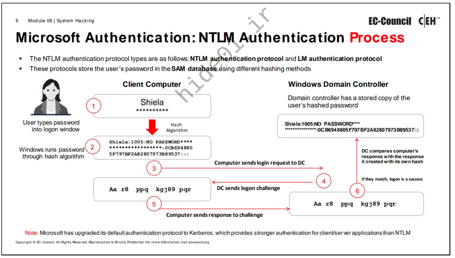
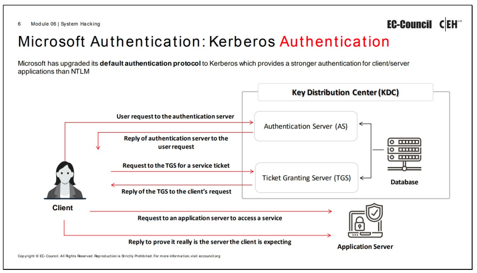

Windows is an operating system made by Microsoft and used by companies and organizations.    
   
Let's take a scenario where you are into Windows and want to dump or want passwords of local and domain users.    
   
Well in this case the windows has two authentication protocols,    
- SAM (Security Account Manager Databases) Authentication   
- Kerberos Authentication    
   
   
### #Security Account Manager (SAM)    
   
- The SAM databases are used to store the passwords of the local account users. The SAM stores, the passwords in a hashed format. This uses a function called "SKYKEY" to partially encrypt the password hashes    
- NOTE The function is used to partially encrypt the password hash's.   
- The location of SAM databases is located "C:\Windows\System32\config\SAM". So this does not mean that we can move the file from one location to another   
- Here is the catch, it is not possible to copy the SAM file to another location in the case of online attack, because the system locks the SAM file with an exclusive file system lock. So the user cannot copy or Move It while the windows is running.    
- The lock does not release until the system throws A blue screen error exception or the OS has been shut down.    
   
   
### **#NT (New Technology) LAN Manager** (**NTLM**)   
   
- NTLM Authentication Manager is the default authentication scheme. That performs authentication for the network services it consists of two protocols.   
- The first is the NTLM authentication and second is the LM authentication protocol. These two protocols use different, hash methodologies, to store user passwords.    
   
   
### #The Process Of Storing Hashed Password's   
   
1. The plane text password is converted into an NTLM hash.    
2. This hashed password is stored in SAM databases.    
3. Then the Sam file is partially encrypted.    
- Now here the "SYSKEY" is a function that adds an extra encryption layer to the SAM password hashes and the "SKYKEY" is also a key used for protecting SAM databases the key is stored in system, registry hive   
   
   
#The Below image is for the auth between the user and the domain controller. Stored in "C:\Windows\NTDS\NTDS.DIT"   
    
   
- Note the local account users password are stored using the NTLM hashing process into SAM databases. Kerberos is a ticket based system used for authentication of users and NTLM is also used as a fallback.   
   
   
### #Kerberos Authentication System   
   
    
   
- Kerberos is a network authentication protocol. That provides strong authentication for client server messages sent through Kerberos protocol and is protected against replay attacks and eveasdropping.    
   
   
- The Kerberos has a KDC (Key Distribution Center) which is a trusted third party. This consists of two logical distinct parts.   
   
   
- An AC (Authentication Server)  and a TGS (Ticket Granting Service), The kerberos use a ticket to prove a user's identity.   
- All the domain controller users and passwords are stored here "C:\Windows\NTDS\NTDS.DIT".   
   
   
