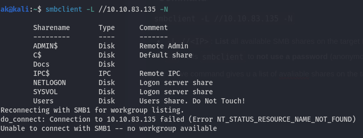
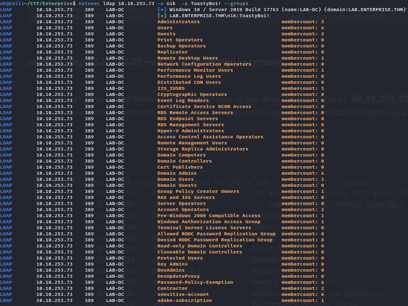
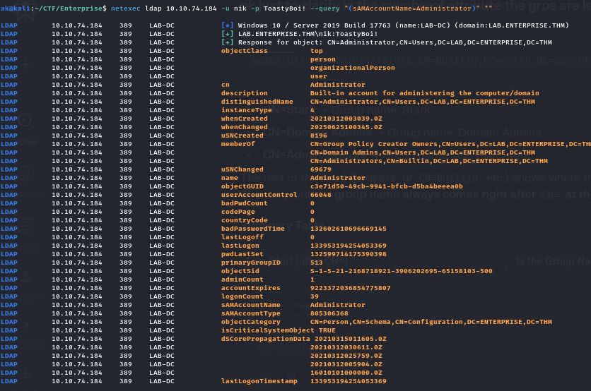

**Windows enumeration** is the process of gathering detailed information about a Windows system or network to identify potential vulnerabilities, access points, or misconfigurations. It's a critical phase in penetration testing and ethical hacking, typically performed after identifying live hosts and open ports.

## Nmap

We can use nmap to scan the target for open ports.

`sudo nmap -sC -sV -A -vv 10.10.11.69`

The output of these ports will be like smb ldap etc. For the first part lets go for the SMB enumeration.

## SMB Enumeration Tools.

1. **smbclient** is a **command-line utility** used to **interact with SMB (Server Message Block) shares** on Windows or Samba servers — similar to how ftp works for file transfers. It allows you to **list, upload, download, and interact with shared files/folders** over the SMB protocol. It’s included in the samba suite on Linux.

2. **NXC** is a command-line tool that helps automate **network recon, credential validation, and AD attacks**, especially against **SMB, RDP, LDAP, WinRM, and Kerberos** protocols.
### sudo crackmapexec smb 10.10.83.135

The above command is used to determine of the SMB signing is true of false. If we know the SMB signing status we can do the following

| Signing Status   | Meaning                                  | Attack Impact                | Security Risk               |
| :--------------: | :--------------------------------------- | :--------------------------- | :------------------------   |
| Signing: True    | SMB signing is enabled and required      | ❌ SMB relay not possible \| | ✅ Secure (recommended)     |
| Signing: False   | SMB signing is disabled or not enforced  | ✅ SMB relay, MITM possible  | ❌ Vulnerable (needs fix)   |

### smbclient -L //10.10.83.135 -N

> Purpose :- Lists all available SMB shares on the target 10.10.83.135 **without authentication** ( -N = no password).

Used for **anonymous enumeration** to discover accessible shares and their permissions.

	-L //<IP>: **List** all available SMB shares on the target IP.
	- N: Tells smbclient to **not use a password** (anonymous login).

The above command gives u a list of available shares on the target. Now we know the shares we can access them by ~~below command.~~

### smbclient //10.10.10.5/Sharename -U User

Purpose :- Connects to a specific SMB share on the target using **a valid username** for authentication. Enables interaction with the share (browse, upload, download files) similar to using an FTP client.

- -U is for the user
- -P is for password. "U can specify it there but if not so user is enough it will ask for password if not specified."

When we are into the smb: \> command line we can download the files using get "filename" and can upload the file using put "filename".

This command is to access share of windows file system.

Assume u have a valid username and password or u find one then u can find the groups and the users from that one valid creds.

### sudo netexec smb 10.10.74.184 -u nik -p ToastyBoi! —users

>Purpose :- Queries the SMB service on `10.10.74.184` using the provided credentials to enumerate all domain users. This helps identify valid usernames, which can be leveraged for Kerberos attacks, password spraying, or privilege analysis.

### netexec ldap 10.10.253.73 -u nik -p ToastyBoi! —groups

>Purpose :- Enumerates **Active Directory groups** on the domain controller at **10.10.253.73** using LDAP authentication with the provided credentials. This helps identify **security groups**, their names, and potentially sensitive targets (e.g., Domain Admins, Backup Operators, Service Accounts, etc.).

### netexec ldap 10.10.253.73 -u nik -p ToastyBoi! --get-sid

>Purpose :- Fetches the **Domain SID (Security Identifier)** for the target domain controller using LDAP. This is essential for attacks like **RID cycling**, **SID-based enumeration**, and **custom impersonation** setups in AD exploitation.

### netexec ldap 10.10.74.184 -u nik -p ToastyBoi! —query "(sAMAccountName=Administrator)" ""

>Purpose :- This command retrieves all LDAP/Active Directory attributes for the Administrator account from the domain controller at 10.10.74.184, using the provided credentials. It's useful for gathering detailed information about the domain's built-in administrator account, such as group memberships, account status, last logon, and more

