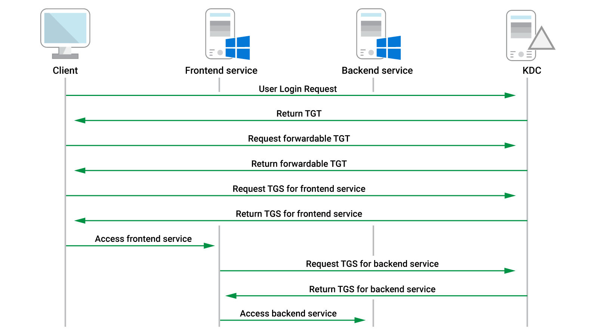

### **Introduction**

In this section, we’ll discuss unconstrained delegation, its specific security ramifications, and
demonstrate how to exploit it. First, we must define unconstrained delegation and explain how it works. We’ll begin with an overview of Kerberos authentication.
  

---
### **Kerberos Communication For Unconstrained Delegation**

Sources OSEP PEN 300

- When a user successfully logs in to a computer, a Ticket Granting Ticket (TGT) is returned. Once the user requests access to a service that uses Kerberos authentication, a Ticket Granting Service ticket (TGS) is generated by the Key Distribution Center (KDC) based on the TGT and returned to the user.

- This TGS is then sent to the service, which validates the access. Note that this TGS only allows that specific user to access that specific service.

- Since the service cannot reuse the TGS to authenticate to a backend service, any Kerberos authentication stops here. Unconstrained delegation solves this with a forwardable TGT.

- When the user requests access for a service ticket against a service that uses unconstrained delegation, the request also includes a forwardable TGT as illustrated in Figure.

- The KDC returns a TGT with the forward flag set along with a session key for that TGT and a regular TGS. The user’s client embeds the TGT and the session key into the TGS and sends it to the service, which can now impersonate the user to the backend service.
  

---