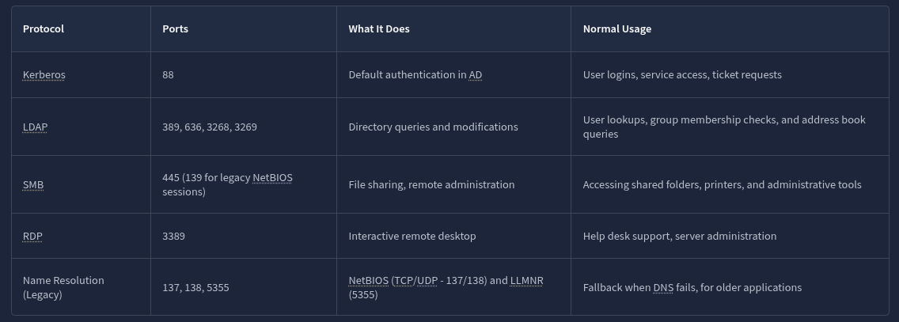
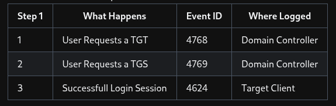
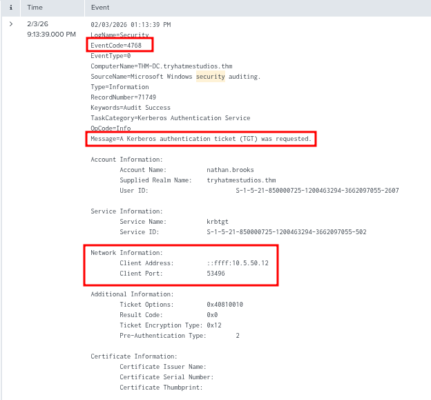
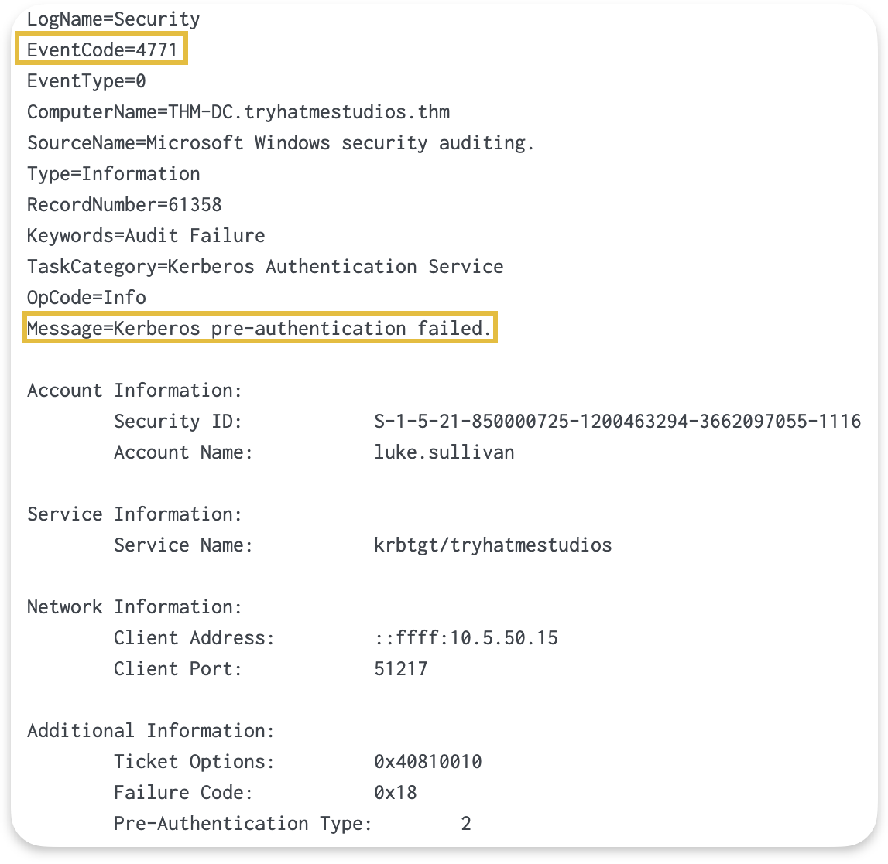
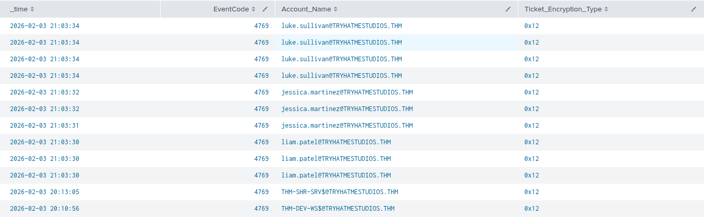
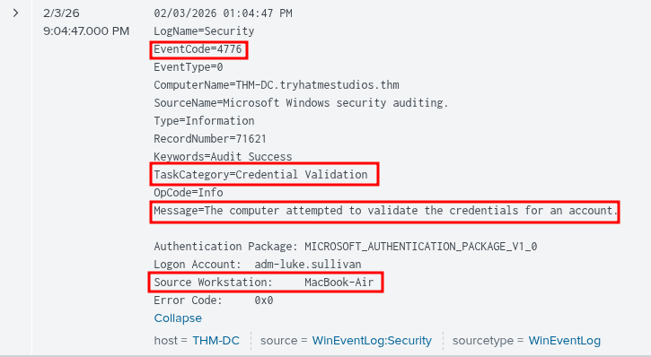
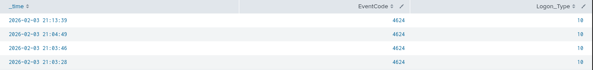

Hey today we will learning some of the techniques in splunk to investigate the windows security event logs as this is a blue theam exercise its better to know what is been captured in logs to get a better hold on attack's we will perform.

## Basics of protocol's

As i am also new to this splunk investigation we need to know some of the protocols and what it does i have a image below which gets a better hold on that.



## Authentication Event ID's

Now that we know the protocols and form where the traffic is generated, to look for security incidents we need to know the event id's generated by windows security logs in order to get a better understanding of attacks.

Lets take a look at the kerberos authentication flow with the event ids followed.
### Kerberos Authentication


When a user requests lets say a login atempt its (1) requests a TGT followed by Event ID **4768** logged at Domain Controller then (2) a TGT issued to user (3) a TGS request is sent follow by Event ID **4769** again logged as Domain Controller (4) and lastly TGS is issued (5) with a successful login atempt followed by Event ID **4624** creating a user session.

All of this can also be simplified as.



Ok that said we know the event ids but how does it acctually look in splunk we can use SPL query like ```index=* EventCode="4768"``` and selecting time line as ```All time``` we get the final event.



In the above image we can see the EventId, Network Information and Message, we can do this for many event codes including **4789** and **4624** . We can also say that not always a user will use a correct passowrd a failed attempt is also generated when a user types incorrect creds which will result is below event with Event ID as **4771**.



Another thing we need to keep in mind is that splunk's SPL language accounts spaces for "(underscores)" meaning if i want to see TGT attempts originated from a source account i can write SPL as ```index=* EventCode=4769 | table _time EventCode Account_Name```

#### Encryption Types for TGT/TGS

Tickets usually are encrypted, and AD uses two encryption types for this:

- RC4 encryption appears in environments with older systems or applications that don't support AES.
- And AES-256 encryption, which modern systems use.

Understanding what should usually appear in our environment helps us determine which encryption types to expect and where they come from.

| Value | Algorithm | When You See It |
|:-----:|:---------:|:---------------:|
| 0x12  | AES-256   | Modern systems, Windows 2008+ domain functional level |
| 0x17  | RC4-HMAC  | Legacy systems, older applications, cross-forest trusts |

I have used ```index=* EventCode=4769 | table _time EventCode Account_Name Ticket_Encryption_Type``` Query to filter out the content as below.



### NTLM Authentication 

As we saw how and what type of EventCodes are associated with successfull/failed TGT/TGS attempts. Now its important to also know about the **fallback** authentication protocols like NTLM and LLMNR, hear we will focus on NTML.


We know that NTML protocol is a fallback protocol which works with IP address whenever user tries to acces a share and the user machine asks DC to validate creds it will result in EventCode of **4776** and when session created it will result is **4624**.


| Step | What Happens | Event ID | Where Logged |
|:----:|:-------------|:--------:|:-------------:|
| 1 | The target server asks the DC to validate credentials | 4776 | Domain Controller |
| 2 | Session created on target | 4624 | Target server |

You can take a look at following Event.

 

## Logon Events And Types

Before moving forwad we need to get some hold on successfull and failed login types, the reason we are discussing this is because the Event ID **4771** is for kerberos failed attempt keep in mind its for kerberos and for other login events like on a client machine (user machine) we have the following.


| Event ID | What Happened     |
|:--------:|:------------------|
| 4624     | User/Service got access and a session was created  |
| 4625     | Failed logon      |

As we now know the difference but how can we identify is its a RDP or File Share Access, for this windows has introduced Login Types.

### Understanding Logon Types

Logon Type is a field in Windows Security events that indicates how a user or service authenticated and what kind of session was created on the system.

- It tells you how access happened, not just that it happened

Helps distinguish:
- A user sitting at a machine
- A remote connection (RDP)
- A background service
- A network request (like file access)

These are some of common logon types to keep in mind.

| Logon Type | Meaning                                             | Example |
|:----------:|-----------------------------------------------------|---------|
| 2          | Interactive (user logs in at console)               | User logs into a laptop using keyboard |
| 3          | Network (accessing shared resource like SMB)        | Accessing a shared folder (\\server\share) |
| 4          | Batch (scheduled task)                              | Scheduled task runs a script at midnight |
| 5          | Service (service account logon)                     | Windows service starts using a service account |
| 7          | Unlock (unlocking workstation)                      | User unlocks their locked PC |
| 8          | NetworkCleartext (credentials sent in cleartext)    | Basic auth to IIS / legacy app |
| 9          | NewCredentials (RunAs)                              | Using `runas /netonly` command |
| 10         | RemoteInteractive (RDP)                             | User logs in via Remote Desktop |
| 11         | CachedInteractive (offline login with cached creds) | Laptop login without domain connectivity |

Ok now moving to splunk if i want to see all Logon Type 10 events i will execute `index=* EventCode="4624" Logon_Type="10" | table _time EventCode Logon_Type` which will result in.




